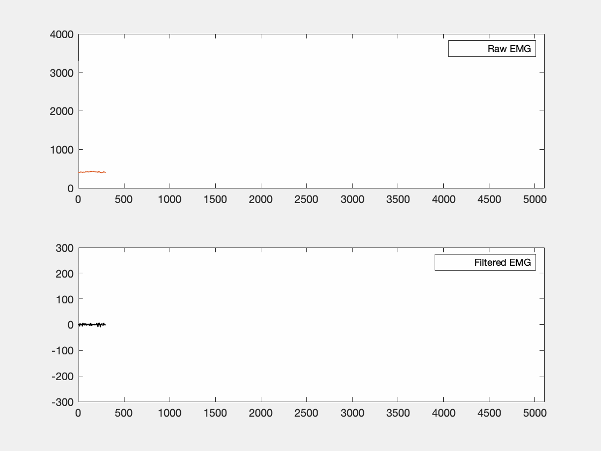
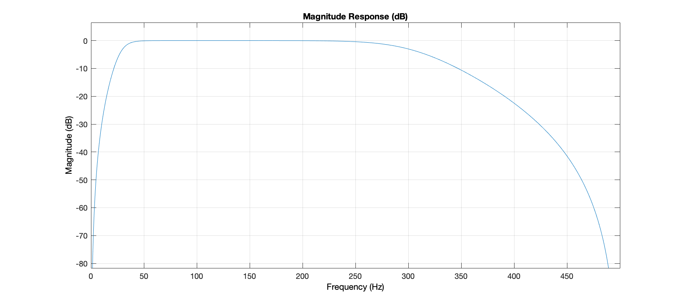
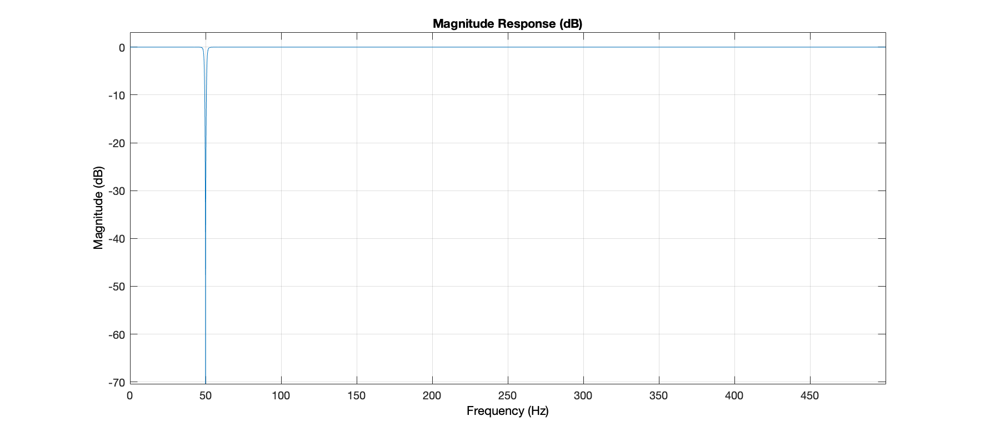

# Embedded EMG singal processing

## Overview
This application uses on-board ADC to convert analog input from an EMG sensor and performs digital signal processing filtering to eliminate frequencies out of the (30hz, 300hz) interval and 50hz disturbance. Processed samples are then sent via serial communication to the PC in order to be plotted. The application has been developed on top of the __Miosix__ embedded operative system which provided real-time operating system (RTOS) features.

## Requirements
- STM32F4x nucleo board (project has been developed using _STM32F401re nucleo_ board)
- EMG sensor
- For embedded software compilation:
  - [Miosix toolchain](https://miosix.org/wiki/index.php?title=Miosix_Toolchain) (for cross compilation)
  - [GNU ARM embedded toolchain](https://developer.arm.com/tools-and-software/open-source-software/developer-tools/gnu-toolchain/gnu-rm/downloads) (linker script)

## External libraries
- [Eigen C++ template library](https://eigen.tuxfamily.org/index.php?title=Main_Page) (linear algebra operations, already embedded in the project)

## How to use
[ 1 ] Connect microcontroller to the PC with the USB cable and open serial communication to read incoming values.

[ 2 ] Connect sensor to analog pin __PA0__ and ground to __GND__.

## Other specifications

#### ADC & TIM
The ADC has been configured in interrupt mode and executes conversions at a 1000hz rate (1000 samples each second). Conversions are triggered by an internal timer (TIM3) that outputs an event each 1ms to start the conversion. TIM3 has a 1000hz frequency thanks to pre-scaling internal clock and setting the auto-reload register accordingly.

#### USART
USART serial interface is used to communicate processed values to the computer. In order to mitigate the bottleneck problem on serial communication, `boudrate` was set to `230400`.

#### DSP
Digital signal is lively processed in order to remove AC noise, remove DC offset, remove 50hz disturbance and mitigate 1/f noise. 
The applied DSP makes use of two __IIR__ filters (bandpass and stopband) and __Zero-phase filtering__ tecnhinque in order to avoid filtering delay. Zero-phase filtering is a non-causal procedure, so it cannot be done in real time. That is why blocks of 300 samples are converted each time making a piece-wise filtering on the whole incoming signal. Because of that, filter's initial conditions was necessary in order to avoid DC noise on interval borders. 

 

Please note: both subplots have different ylim. The file containing this simulation can be found in the `misc/DSPemgsignal.m` file.

	y[t] = b[0] x[t] + b[1] x[t-1] + ... - a[1] y[t-1] - a[2] y[t-2] - ...
Filtering is done twice for each filtering, one back and one forth inverting the signal on second pass. In the end, N samples are filtered 4 times. Twice for the two filters (bandpass and stopband).

The general form of a discrete filter is

where N is the order of the filter, `a_i` are denumerators coefficient and `b_i` are denominator coefficients.

##### Bandpass
7th order IIR filter (30hz, 300hz)
	
    a_coeff: 1,-2.13183455555828,1.47978011393210,-0.679740843101842,0.584825906895303,-0.218461835750097,-0.0211926261278646
    b_coeff 0.199880906801133,0,-0.599642720403399,0,0.599642720403399,0,-0.199880906801133

 

##### Stopband
5th order IIR filter (50hz)
	
    a_coeff 1,-3.78739953308251,5.56839789935512,-3.75389400776205,0.982385450614124
    b_coeff: 0.991153595101663,-3.77064677042227,5.56847615976590,-3.77064677042227,0.991153595101663
    

 

## MSX_HAL
`TODO`

## Utility
[ - ] Possibilities for serial reading:
- [`PuTTY`](https://putty.org) (Windows, free) 
- [`Serial`](https://www.decisivetactics.com/products/serial/) (Mac, $39.99)
- `ls -l /dev/ttyX` where X is the tty relative to serial port

[ - ] Use command `make all` in the `miosix-kernel` folder for embedded software compilation.

[ - ] Use `st-flash write main.bin 0x08000000` command to flash generated bin executable into the board.

[ - ] `data.txt` contains raw sampling values from the sensor that can be used to simulate incoming raw values form the microcontroller.

[ - ] `DSPemgsignal.m` __Matlab__ file inside the `misc/` folder can be used to plot either live receiving data from serial port using or simulated values.

[ - ] ~~`xxx.ipynb ` __Python notebook__ file inside the `misc/` folder can be used to plot either live receiving data from serial port using or simulated values.~~ (currently not available)

